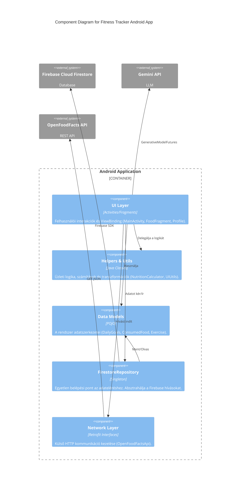

# C4 Component Diagram

Ez a diagram az Android alkalmazás belső komponenseit és mappastruktúráját (Layer Boundaries) ábrázolja, bemutatva a felelősségi körök szétválasztását.

## Komponensek Leírása
* **UI Layer:** Itt találhatók a képernyők. Közvetlenül nem végeznek adatbázis műveletet és nem számolnak makrókat, hanem a `Helpers` és a `Repository` rétegre támaszkodnak.
* **Helpers:** Célja a kód újrahasználhatósága és a tesztelhetőség. A `NutritionCalculator` például tisztán kapott paraméterekkel dolgozik, így hálózat és kontextus nélkül tesztelhető.
* **Repository:** A "Single Source of Truth" mintát követve ez az egyetlen osztály, amely importálja a `FirebaseFirestore` objektumokat. Ha a jövőben adatbázist cserélnénk, csak ezt az egy osztályt kell átírni.
