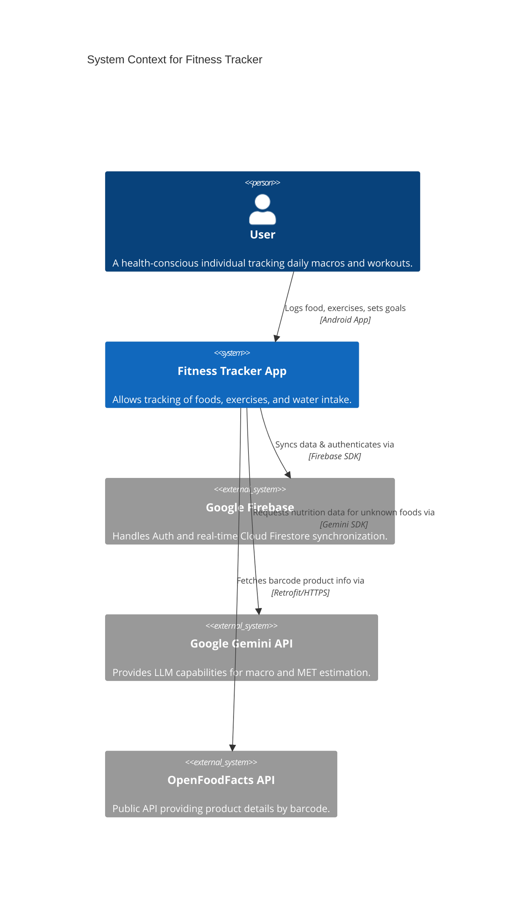
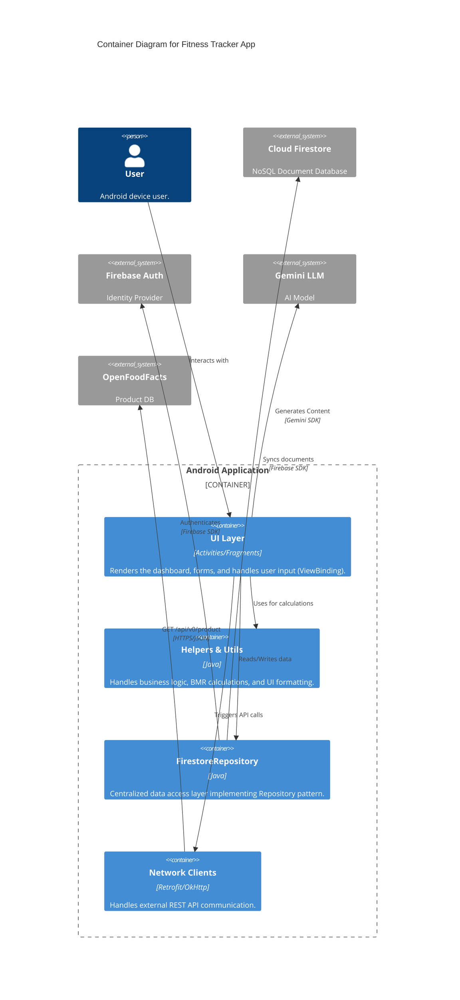

# C4 Context and Container Diagrams

## Context Diagram

```mermaid
C4Context
    title System Context for Fitness Tracker

    Person(user, "User", "A health-conscious individual tracking daily macros and workouts.")
    System(fitnessApp, "Fitness Tracker App", "Allows tracking of foods, exercises, and water intake.")
    
    System_Ext(firebase, "Google Firebase", "Handles Auth and real-time Cloud Firestore synchronization.")
    System_Ext(gemini, "Google Gemini API", "Provides LLM capabilities for macro and MET estimation.")
    System_Ext(openfoodfacts, "OpenFoodFacts API", "Public API providing product details by barcode.")

    Rel(user, fitnessApp, "Logs food, exercises, sets goals", "Android App")
    Rel(fitnessApp, firebase, "Syncs data & authenticates via", "Firebase SDK")
    Rel(fitnessApp, gemini, "Requests nutrition data for unknown foods via", "Gemini SDK")
    Rel(fitnessApp, openfoodfacts, "Fetches barcode product info via", "Retrofit/HTTPS")
```

## Container Diagram

```mermaid
C4Container
    title Container Diagram for Fitness Tracker App

    Person(user, "User", "Android device user.")

    Container_Boundary(app, "Android Application") {
        Container(ui, "UI Layer", "Activities/Fragments", "Renders the dashboard, forms, and handles user input (ViewBinding).")
        Container(helpers, "Helpers & Utils", "Java", "Handles business logic, BMR calculations, and UI formatting.")
        Container(repo, "FirestoreRepository", "Java", "Centralized data access layer implementing Repository pattern.")
        Container(network, "Network Clients", "Retrofit/OkHttp", "Handles external REST API communication.")
    }

    System_Ext(firestore, "Cloud Firestore", "NoSQL Document Database")
    System_Ext(auth, "Firebase Auth", "Identity Provider")
    System_Ext(gemini_api, "Gemini LLM", "AI Model")
    System_Ext(off_api, "OpenFoodFacts", "Product DB")

    Rel(user, ui, "Interacts with")
    Rel(ui, helpers, "Uses for calculations")
    Rel(ui, repo, "Reads/Writes data")
    Rel(ui, network, "Triggers API calls")
    
    Rel(repo, firestore, "Syncs documents", "Firebase SDK")
    Rel(repo, auth, "Authenticates", "Firebase SDK")
    Rel(network, off_api, "GET /api/v0/product", "HTTPS/JSON")
    Rel(ui, gemini_api, "Generates Content", "Gemini SDK")
```
