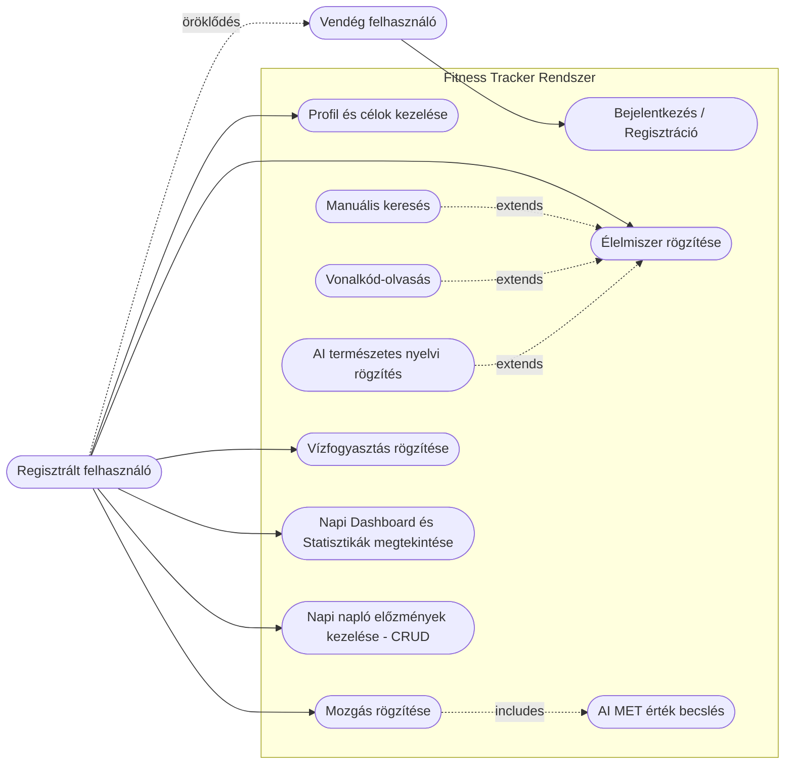

# Fitness Tracker - Use Case Diagram

Az alábbi Use-Case (használati eset) diagram a rendszer aktorait (Vendég és Regisztrált felhasználó) és a hozzájuk tartozó funkciókat mutatja be, beleértve a kiterjesztés (extends) és tartalmazás (includes) kapcsolatokat a különböző rögzítési módszerek és az AI modulok között.

## A diagram értelmezése:

1. **Aktorok:**
   - **Vendég felhasználó:** Csak a publikus felületekhez fér hozzá (regisztráció és bejelentkezés).
   - **Regisztrált felhasználó:** Örökli a vendég képességeit, de hozzáfér a zárt rendszer összes funkciójához.

2. **Élelmiszer rögzítése (Extends kapcsolatok):**
   - Az élelmiszer rögzítése egy általános használati eset, amit 3 speciális folyamat terjeszthet ki (extends): *Vonalkód-olvasás*, *AI alapú rögzítés*, és a *Manuális keresés*.
   
3. **Mozgás rögzítése (Includes kapcsolat):**
   - Amikor egy felhasználó mozgást rögzít, az alkalmazás a háttérben kötelezően meghívja a Gemini AI-t a kalóriaégetés kiszámításához, ezért ez egy (includes) tartalmazó kapcsolat.
